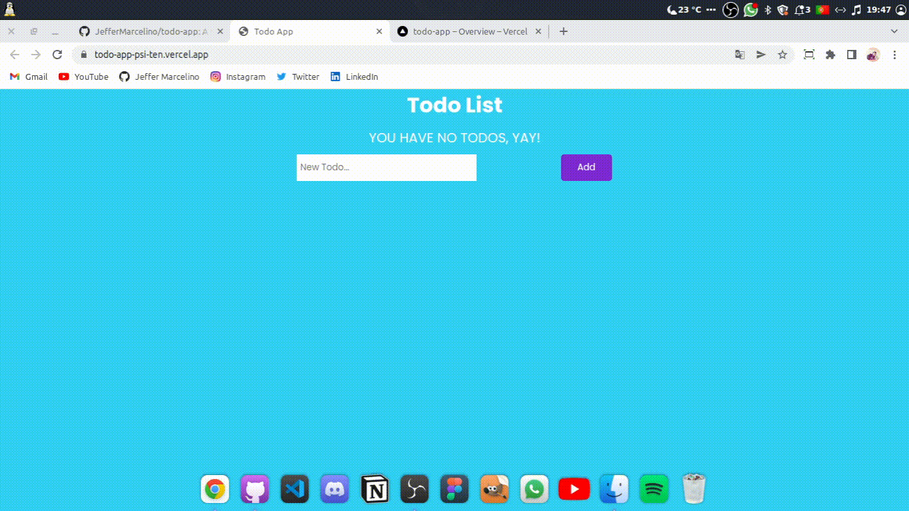
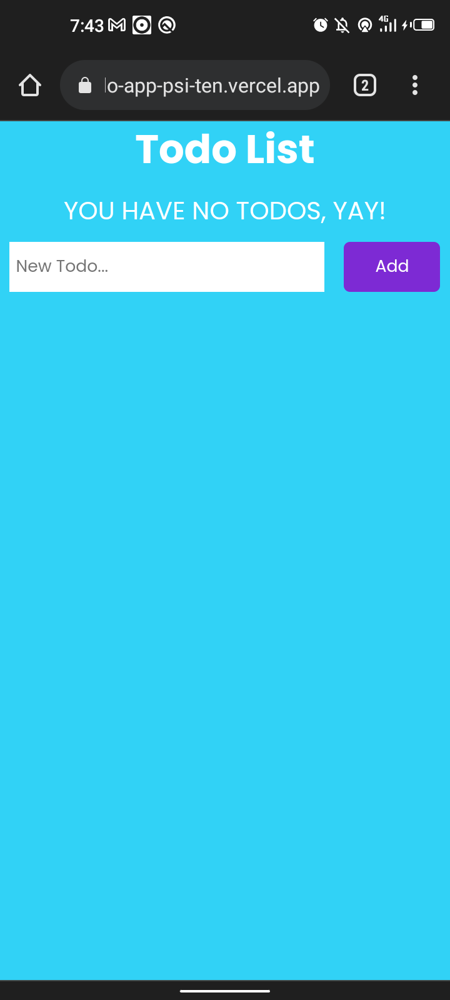
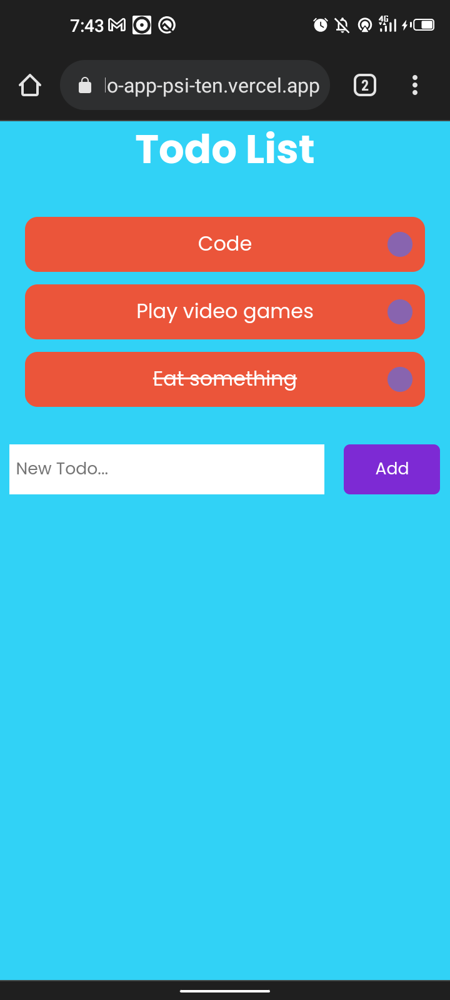

# Todo APP

# Previews
### Computer:

  

 

### Mobile:
 

 

## 🚀 Technologies

This project was developed with the following technologies:
- HTML
- CSS
- JavaScript
- ReactJS
- ViteJS

## 💻 Project

This is a simple to-do app that you can make a list of things you want to do.

## 📝 Licença

This project is under MIT license. See the [LICENSE](./LICENSE) file for more details.

---

Made by ♥ :wave: [Jeffer Marcelino!](https://github.com/JefferMarcelino/)
